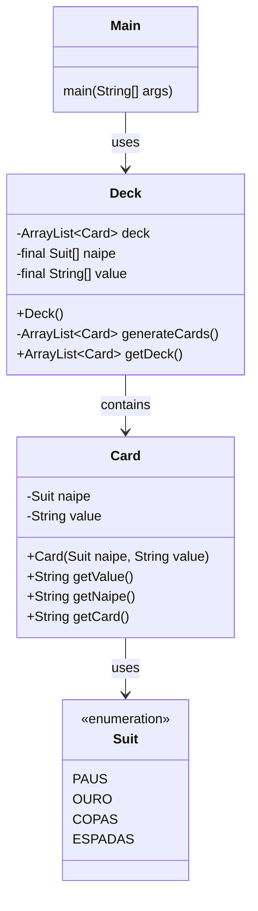

# Desafio de Jogo de Cartas

Este projeto é um desafio de programação em Java que simula um jogo de cartas simples entre um jogador e o computador. Cada jogador escolhe uma carta aleatória de um baralho, e o vencedor é determinado com base no naipe e no valor das cartas.

## Estrutura do Projeto

O projeto consiste em quatro classes principais:

1. **Main**: A classe principal que executa o programa.
2. **Suit**: Enumeração que define os naipes das cartas.
3. **Card**: Classe que representa uma carta do baralho.
4. **Deck**: Classe que representa um baralho de cartas.

## Diagrama de Classes



## Como Executar

1. Clone este repositório.
2. Navegue até o diretório do projeto.
3. Compile o código-fonte com o seguinte comando:
    ```sh
    javac Main.java
    ```
4. Execute o programa com o seguinte comando:
    ```sh
    java Main
    ```

## Regras do Jogo

1. Um baralho de cartas é gerado aleatoriamente.
2. O computador e o jogador escolhem uma carta aleatória do baralho.
3. As cartas são comparadas primeiro pelo naipe, na ordem: PAUS < OURO < COPAS < ESPADAS.
4. Se as cartas tiverem o mesmo naipe, são comparadas pelo valor, na ordem: 2 < 3 < 4 < 5 < 6 < 7 < 8 < 9 < 10 < J < Q < K < A.
5. O vencedor é anunciado com base nas comparações acima.

## Exemplo de Saída

```plaintext
Computador: E5
Player: OQ
Player venceu!
```

## Autor

Este projeto foi desenvolvido como parte de um desafio de programação.

Sinta-se à vontade para contribuir com melhorias ou relatar problemas!

## Licença

Este projeto é licenciado sob os termos da licença MIT. Veja o arquivo [LICENSE](LICENSE) para mais detalhes.